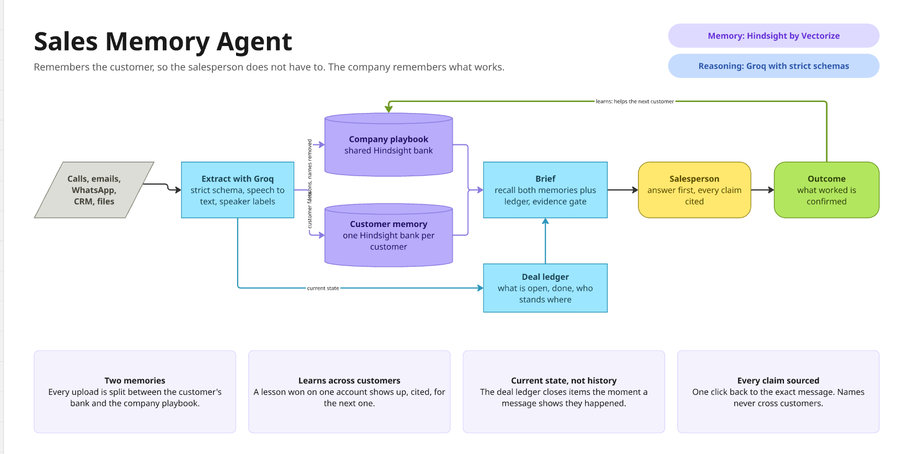
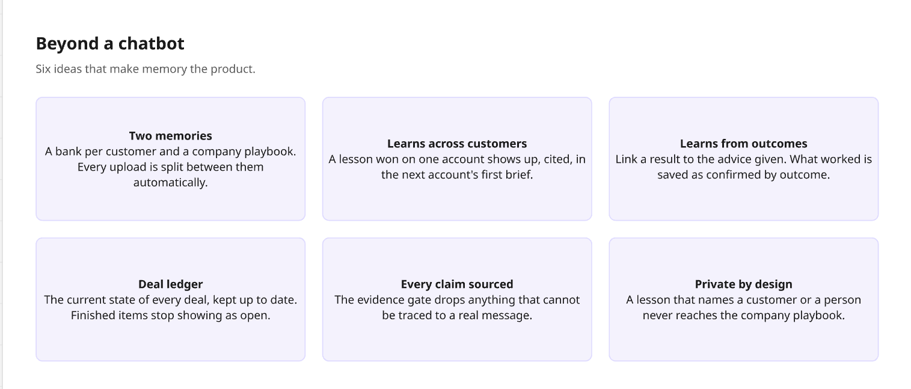
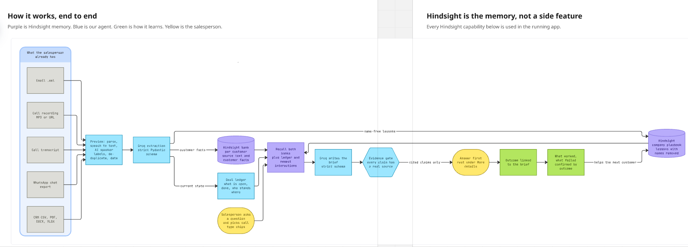
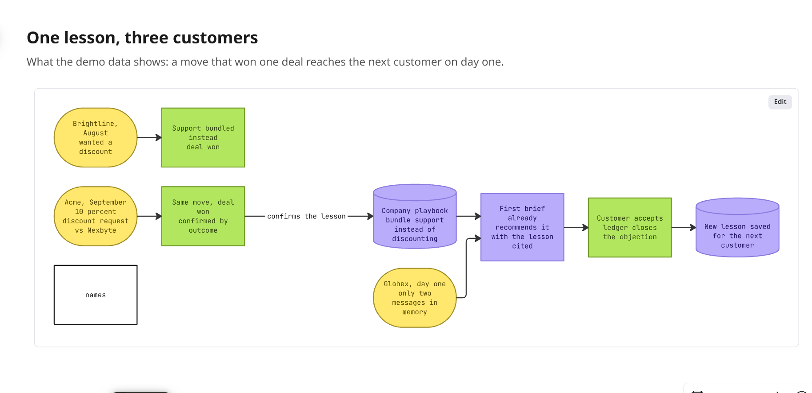

# Sales Memory Agent

**Remembers the customer so the salesperson doesn't have to.**

> **Start here: [`docs/GUIDE.md`](docs/GUIDE.md)** — what the app does, how it uses Hindsight, how to use it, every prompt,
> a demo script and the known limits. Demo logins are in section 4 of the guide.

Sales conversations are scattered across calls, email, WhatsApp and the CRM. A sales executive logs in, picks a
customer, adds what happened (a call recording, a transcript, an email, a WhatsApp export, a CRM export or a file),
and asks for a brief before the next call. The agent answers from **two memories**: everything this customer said,
and everything the company has learned from all its other customers. Every claim links to the message it came from.

## At a glance





### How it works, end to end

Purple is Hindsight memory. Blue is our agent. Green is how it learns. Yellow is the salesperson.



### One lesson, three customers

What the demo data shows: a move that won one deal reaches the next customer on day one.



## How Hindsight memory is used

```
                ┌── customer facts + source text ──► bank  cust-<id>   (one per customer)
new interaction ┤
 (one extraction)└── generalised, name-free lessons ─► bank  company    (shared playbook)

every upload also updates the DEAL LEDGER (current state, MongoDB) with one strict Groq call

brief = ledger + recall(cust-<id>) + recall(company, filtered by industry) → Groq (strict Pydantic output) → cited report
```

| Step | Hindsight operation |
|---|---|
| New customer | `create_bank` for `cust-<id>` with sales extraction instructions |
| Remember an interaction | `retain` the source text into `cust-<id>` (one document per call / email / WhatsApp day / file, `document_id` = `CALL-07`, `EM-12`, `WA-2026-09-24` …); WhatsApp days use `update_mode: append` |
| Learn for the company | `retain` each generalised lesson into `company`, tagged `industry:*`, `role:*`, `kind:*` (queued, `retain_async`) |
| Brief / answer | `recall` the customer bank (3 angles) + the company bank (this industry, then all) → one Groq call |
| Profile | `recall` 4 angles → Groq → cached in MongoDB until memory changes |
| Show sources | `list_documents` / `get_document` |

**Our additions on top of Hindsight:**
- **The split.** One Groq extraction per interaction separates customer facts from reusable lessons. A lesson that
  names the customer or any of its people is withheld, so one customer's data never reaches another's brief.
- **The learning loop.** When an interaction is linked to an earlier brief, the extraction compares the advice with
  what happened and writes `what_worked` / `what_failed` lessons marked `confirmed_outcome`.
- **The deal ledger.** Each customer's current state (open / done items, where each person stands), updated on every
  upload and read first by every brief; open items and stances in a brief come from it in code. See
  `docs/architecture/deal-ledger.md`.
- **The evidence gate.** Every cited id must exist in memory; unsourced claims are dropped and counted.
- **Structured output everywhere.** Every LLM call returns a Pydantic model through Groq strict structured outputs.

## The prompt

A brief's prompt is built in layers: the **organisation's main prompt** (what every brief must deliver; stored in
MongoDB and edited by an admin on the Settings page) + **locked evidence rules** + **prompt pieces** the executive
picks (call type: discovery, negotiation, closing …; focus: price objection, ROI, security …) + **their own
question**. See `backend/memory_agent/prompts.py`.

## Layout

| Path | What |
|---|---|
| `backend/main.py`, `api_v2.py` | FastAPI app and routes |
| `backend/auth.py`, `db.py` | Login (bcrypt + JWT), per-customer permission check, MongoDB |
| `backend/contracts.py` | Every request/response and LLM schema (Pydantic) |
| `backend/memory_agent/` | The agent: parsing, speech-to-text, extraction, Hindsight access, deal ledger, reports |
| `backend/seed_demo.py`, `sample_data/` | Demo logins, three customers, 20 interactions |
| `backend/build_deal.py` | Builds `acme_import.json` from the Maven Analytics CRM dataset |
| `frontend/src/` | React app; `api-types.ts` is generated from the backend's OpenAPI schema |
| `docs/architecture/` | Design: pipeline, memory shape, auth, contracts, decisions |

## Data

- **Acme Corporation:** real rows from the [Maven Analytics CRM Sales Opportunities](https://mavenanalytics.io/data-playground)
  dataset (opportunity `S3W6Q07M`, dates shifted into 2026) plus generated emails, calls and WhatsApp messages.
- **Brightline Logistics, Globex Systems:** generated. All people and companies are fictional.

## Run locally

```bash
python -m venv .venv && .venv/Scripts/pip install -r backend/requirements.txt   # macOS/Linux: .venv/bin/pip
cp backend/.env.example .env              # repo root; fill in the keys (see Environment)
cd backend
../.venv/Scripts/python seed_demo.py      # demo logins + customers + interactions (uses Groq + Hindsight credits)
../.venv/Scripts/python -m uvicorn main:app --reload     # http://localhost:8000
../.venv/Scripts/python test_memory_agent.py             # offline tests, no keys needed
```

```bash
cd frontend
npm install
echo VITE_API_URL=http://localhost:8000 > .env.local
npm run dev                               # http://localhost:5173
npm run gen:api                           # after changing backend contracts: regenerate src/api-types.ts
```

Demo logins (password = `DEMO_PASSWORD` from `.env`): `kami@clarity.example` (Acme, Globex),
`rahul@clarity.example` (Brightline), `admin@clarity.example` (all customers + Settings).

## Environment

| Variable | Where | Value |
|---|---|---|
| `HINDSIGHT_API_KEY` | backend | Hindsight Cloud key |
| `GROQ_API_KEY`, `GROQ_MODEL` | backend | Groq key; `openai/gpt-oss-120b` |
| `GROQ_API_KEYS` | backend | several Groq keys, comma-separated, no spaces; rotated when one hits its per-minute or per-day limit (free tier: 200,000 tokens per model per key per day) |
| `MONGODB_URI`, `MONGODB_DB` | backend | Atlas connection string and database name |
| `JWT_SECRET` | backend | random string that signs login tokens |
| `CLIENT_URL` | backend | deployed frontend URL(s), comma-separated (CORS); localhost is always allowed |
| `DEMO_PASSWORD` | local only | password `seed_demo.py` gives the demo logins |
| `VITE_API_URL` | frontend | backend URL (`.env.local` for dev, `.env.production` for Vercel) |

## Deploy

Pushing to `main` deploys both Vercel projects (Root Directory `backend` and `frontend`). The backend project needs
every backend variable above, and MongoDB Atlas must accept connections from Vercel (Network Access).

Limits that shape the design: Vercel request bodies are capped at 4.5 MB (uploads over 4 MB are refused; long call
recordings go in as a URL, which Groq fetches itself), and functions run at most 300 s (`vercel.json`).

## Demo (2 minutes)

1. Log in as Kami, open **Globex** (only two items in memory) and ask *"First call with Lena and Omar. How do I win
   this?"* with **Discovery** + **ROI for finance**. The brief already carries lessons learned on Acme and Brightline
   (security docs early, multi-year cost comparison), each linked to the lesson.
2. Upload a WhatsApp export where security approves and finance accepts bundled support, linked to that brief.
   The playbook gains a `confirmed_outcome` lesson.
3. Open **Acme** and ask about Michael's 10 % discount with **Negotiation** + **Price objection**: the brief uses the
   bundled-support lesson, and every point links to its email, call or lesson.
4. As admin, change the main prompt in **Settings** and ask again.

**Credits:** each remembered item costs roughly $0.02–0.05 of Hindsight retain; briefs use cheap recall plus Groq.
